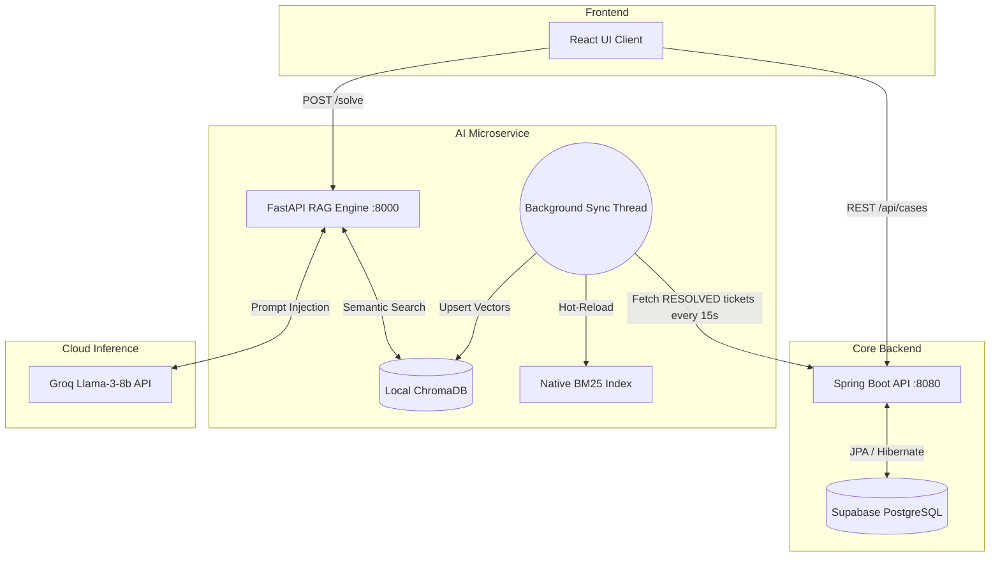

<div align="center">

# Resolution Desk
### Enterprise AI Case Management & Autonomous Triage System

[](https://reactjs.org/)
[](https://spring.io/projects/spring-boot)
[](https://fastapi.tiangolo.com/)
[](https://supabase.com/)
[](https://groq.com/)

*An autonomous, self-learning IT support platform featuring Hybrid RAG, real-time vector synchronization, and a decoupled microservice architecture.*

**Watch the System Demo:** *(Insert a link to your demo video or GIF here)*

</div>

---

## Table of Contents
- [Core Features](#core-features)
- [System Architecture](#system-architecture)
- [Machine Learning Pipeline](#machine-learning-pipeline)
- [Enterprise Security & Privacy](#enterprise-security--privacy)
- [Project Structure](#project-structure)
- [API Reference](#api-reference)
- [Local Installation & Boot Sequence](#local-installation--boot-sequence)
- [Performance Benchmarks](#performance-benchmarks)
- [Development Roadmap](#development-roadmap)
- [Troubleshooting](#troubleshooting)

---

## Core Features

- **Zero-Hallucination AI Triage:** Automatically solves incoming tickets based exclusively on historically verified company data.
- **Autonomous Database Synchronization:** A background daemon dynamically learns new resolutions logged by human engineers in real-time without requiring server restarts.
- **Enterprise Dashboard:** Real-time analytics tracking system layer outages, hardware faults, and team resolution metrics.
- **Context-Aware Cloud Co-Pilot:** A chat assistant for Level 3 engineers, strictly bound to verified infrastructure runbooks via Reciprocal Rank Fusion (RRF).

---

## System Architecture

Resolution Desk operates on a fully decoupled 3-tier microservice architecture.

The most critical component is the **Autonomous Background Worker**. To prevent vector database corruption in distributed environments, the local ChromaDB instance is intentionally excluded from version control. Instead, a lightweight Python daemon wakes up every 15 seconds, queries the Java backend for newly resolved tickets in the Supabase cloud, and dynamically hot-reloads the local neural embeddings.



---

## Machine Learning Pipeline

Standard semantic search (dense retrieval) often fails on highly specific IT infrastructure queries containing exact error codes or hardware serials. To solve this, the `/solve` endpoint runs a custom **Hybrid RRF Pipeline**:

1. **Sparse Retrieval (Native BM25):** A custom-built BM25 engine tokenizes logs and scores exact-keyword matches (TF-IDF).
2. **Dense Retrieval (SentenceTransformers):** `all-MiniLM-L6-v2` maps the structural meaning of the customer's query into high-dimensional vector space via ChromaDB.
3. **Reciprocal Rank Fusion (RRF):** The engine mathematically merges the sparse and dense results to surface candidates that match both exact keywords and overall semantic meaning.
4. **Cross-Encoder Validation:** Finally, a neural reranker (`ms-marco-MiniLM-L-6-v2`) grades the exact contextual relationship between the query and the historical fix.

**Deterministic Fallback Protocol:** If the cross-encoder score falls below `1.0`, the system aborts auto-resolution and raises `FLAG_FOR_REVIEW` to prevent hallucinated fixes on production servers.

---

## Enterprise Security & Privacy

Resolution Desk is engineered with corporate data privacy as a primary directive:
- **Zero-Retention Inference:** The Groq Cloud LLM API is utilized exclusively as a stateless inference engine. No proprietary IT infrastructure data is used to train downstream models.
- **On-Premise Vectorization:** The ChromaDB vector store and sentence-transformer embeddings run 100% locally on the host machine. 
- **Role-Based Access Preparation:** The Supabase PostgreSQL schema is structured to support Row Level Security (RLS) for future multi-tenant deployments.

---

## Project Structure

```text
Resolution-Desk-Enterprise/
├── java-backend/               # Spring Boot Application (Port 8080)
│   ├── src/main/java/          # Business logic, controllers, and JPA repositories
│   └── src/main/resources/     # application.properties (DB configurations)
├── python-engine/              # FastAPI Microservice (Port 8000)
│   ├── main_api.py             # Hybrid RAG Engine and Background Worker
│   ├── requirements.txt        # Python dependencies
│   └── .env                    # Cloud inference API keys (Git-ignored)
└── react-frontend/             # React Client UI (Port 3000/5173)
    ├── src/                    # Components, views, and state management
    └── package.json            # Node dependencies
```

---

## API Reference

### Core Operations (Spring Boot — Port 8080)
| Endpoint | Method | Description |
| --- | --- | --- |
| `/api/cases` | `GET` | Fetch all cases. Accepts `?status=` and `?category=` filters. |
| `/api/cases` | `POST` | Log a new case. Auto-generates a `CASE-YYYY-XXXXX` ID. |
| `/api/cases/{id}` | `PATCH` | Update ticket status or resolution notes. |

### AI Inference (FastAPI — Port 8000)
| Endpoint | Method | Description |
| --- | --- | --- |
| `/solve` | `POST` | Accepts a ticket description and returns a RAG-verified resolution, or flags it for manual review. |
| `/chat` | `POST` | Interactive co-pilot restricted strictly to verified historical runbook data. |
| `/ping` | `GET` | System health check for the AI microservice. |

---

## Local Installation & Boot Sequence

### Prerequisites
- Node.js v18+
- Python 3.10+
- Java 17+ & Maven 3.8+

### 1. Clone & Configure Environment
```bash
git clone https://github.com/yourusername/resolution-desk-enterprise.git
cd resolution-desk-enterprise
```

Create a `.env` file in the `python-engine` directory:
```env
GROQ_API_KEY="your_groq_api_key_here"
```

Update `java-backend/src/main/resources/application.properties` with your Supabase credentials:
```properties
spring.datasource.url=jdbc:postgresql://[YOUR_SUPABASE_URL]
spring.datasource.username=postgres
spring.datasource.password=[YOUR_DB_PASSWORD]
```

### 2. Boot Terminal 1: Core Backend (Java)
*Note: Java must boot first to establish the database connection before the Python worker initiates.*
```bash
cd java-backend
mvn spring-boot:run
```

### 3. Boot Terminal 2: AI Engine (Python)
*Note: A virtual environment is strictly required to isolate the machine learning dependencies.*
```bash
cd python-engine
python -m venv venv
source venv/bin/activate  # (On Windows use: venv\Scripts\activate)
pip install -r requirements.txt
uvicorn main_api:app --reload --port 8000
```
*Wait for the background thread to print: `Re-indexed successfully.`*

### 4. Boot Terminal 3: Client UI (React)
```bash
cd react-frontend
npm install
npm run dev
```

---

## Performance Benchmarks

*Simulated under standard local development conditions (Apple M-Series / Intel i7):*
- **Vector Retrieval (ChromaDB + BM25):** `< 45ms`
- **Neural Re-ranking (Cross-Encoder):** `< 120ms`
- **LLM Synthesis (Groq Llama-3-8b):** `~ 600ms - 900ms`
- **Total Triage Pipeline Latency:** `~ 1.1 seconds`

---

## Development Roadmap

- **Phase 1 (Completed):** Core Microservices, Hybrid RAG, Autonomous Synchronization.
- **Phase 2 (Upcoming):** Slack/Microsoft Teams webhook integrations for immediate alert triage.
- **Phase 3 (Upcoming):** JWT Authentication and Role-Based Access Control (RBAC) for Level 1 vs Level 3 engineers.
- **Phase 4 (Upcoming):** Docker Compose implementation for 1-click containerized deployment.

---

## Troubleshooting

- **Vector Database Errors on Boot:** If ChromaDB throws persistent SQLite errors, delete the `vector_store` directory inside `python-engine`. The autonomous loop will rebuild it from the cloud database automatically on the next boot.
- **Port Conflicts:** Ensure ports `8000` (FastAPI), `8080` (Spring Boot), and `3000/5173` (React) are free. Use `kill -9 <PID>` on Unix systems or Task Manager on Windows to terminate stalled processes.
- **Missing API Keys:** If the Python engine throws an inference error, verify your `.env` file is properly formatted and the `python-dotenv` package is installed.

<div align="center">

*Engineered for enterprise IT operations.*

</div>
