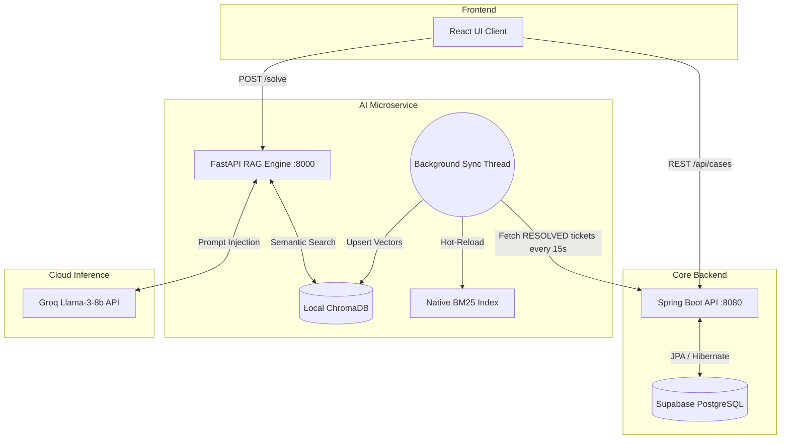

<div align="center">

# ⚡ Resolution Desk
### Enterprise-Grade AI Case Management & Autonomous Triage System

[](https://reactjs.org/)
[](https://spring.io/projects/spring-boot)
[](https://fastapi.tiangolo.com/)
[](https://supabase.com/)
[](https://groq.com/)

*An autonomous, self-learning IT support nervous system featuring Hybrid RAG, real-time vector synchronization, and a decoupled microservice architecture.*

---
</div>

## 📖 Table of Contents
- [System Architecture](#-system-architecture)
- [The AI Engine: Hybrid RAG & Re-ranking](#-the-ai-engine-hybrid-rag--re-ranking)
- [Deployment Modes](#-deployment-modes)
- [API Reference](#-api-reference)
- [Local Installation](#-local-installation)
- [Environment Variables](#-environment-variables)

---

## 🏗 System Architecture

Resolution Desk operates on a fully decoupled 3-tier microservice architecture.

The most critical component is the **Autonomous Background Worker**. To prevent vector database corruption in distributed environments, the local ChromaDB instance is intentionally excluded from version control. Instead, a lightweight Python daemon wakes up every 15 seconds, queries the Java backend for newly resolved tickets in the Supabase cloud, and dynamically hot-reloads the local neural embeddings in real time.



---

## 🧠 The AI Engine: Hybrid RAG & Re-ranking

Standard semantic search (dense retrieval) often fails on highly specific IT infrastructure queries — think exact error codes or hardware serials. To solve this, the `/solve` endpoint runs a **hybrid RRF pipeline**:

1. **Sparse Retrieval (Native BM25):** A custom-built BM25 engine tokenizes logs and scores exact-keyword matches (TF-IDF).
2. **Dense Retrieval (SentenceTransformers):** `all-MiniLM-L6-v2` maps the structural meaning of the customer's query into high-dimensional vector space via ChromaDB.
3. **Reciprocal Rank Fusion (RRF):** The engine mathematically merges the sparse and dense results to surface candidates that match both exact keywords and overall semantic meaning.
4. **Cross-Encoder Validation:** Finally, a neural reranker (`ms-marco-MiniLM-L-6-v2`) grades the exact contextual relationship between the query and the historical fix.

> **Safety protocol:** If the cross-encoder score falls below `1.0`, the system aborts auto-resolution and raises `FLAG_FOR_REVIEW` instead of risking a hallucinated fix.

---

## 🔌 Deployment Modes

- **Mode A — Full Stack Application:** Run the React UI alongside both backends for a complete, out-of-the-box ticketing dashboard for IT operations teams.
- **Mode B — Headless AI Microservice:** Because the FastAPI engine runs independently, teams already on Jira, Zendesk, or ServiceNow can route their webhooks straight to `/solve` and get AI triage without adopting the full stack.

---

## 📡 API Reference

### Core Operations (Spring Boot — Port 8080)

| Endpoint | Method | Description |
| --- | --- | --- |
| `/api/cases` | `GET` | Fetch all cases. Accepts `?status=` and `?category=` filters. |
| `/api/cases` | `POST` | Log a new case. Auto-generates a `CASE-YYYY-XXXXX` ID. |
| `/api/cases/{id}` | `PATCH` | Update ticket status or resolution notes. |

### AI Inference (FastAPI — Port 8000)

| Endpoint | Method | Description |
| --- | --- | --- |
| `/solve` | `POST` | Accepts a ticket description and returns a RAG-verified resolution, or flags it for human review. |
| `/chat` | `POST` | Interactive co-pilot restricted to verified historical runbook data. |
| `/ping` | `GET` | Health check for the AI microservice. |

---

## 🛠 Local Installation

### 1. Clone the repo

```bash
git clone https://github.com/yourusername/ai-resolution-desk.git
cd ai-resolution-desk
```

### 2. Configure environment

Create a `.env` file in the `python-engine` directory:

```env
GROQ_API_KEY="your_groq_api_key_here"
```

Update `java-backend/src/main/resources/application.properties`:

```properties
spring.datasource.url=jdbc:postgresql://[YOUR_SUPABASE_URL]
spring.datasource.username=postgres
spring.datasource.password=[YOUR_DB_PASSWORD]
```

### 3. Initialize the microservices

**Terminal 1 — AI Engine:**

```bash
cd python-engine
pip install -r requirements.txt
uvicorn main_api:app --reload --port 8000
```

Wait for the background thread to print `Re-indexed successfully.`

**Terminal 2 — Core Backend:**

```bash
cd java-backend
mvn spring-boot:run
```

**Terminal 3 — Client UI:**

```bash
cd react-frontend
npm install
npm run dev
```

---

## 🔑 Environment Variables

| Variable | Location | Required | Description |
| --- | --- | --- | --- |
| `GROQ_API_KEY` | `python-engine/.env` | ✅ | Auth key for Groq's Llama 3 8B inference API. Never commit this file. |
| `spring.datasource.url` | `application.properties` | ✅ | Supabase Postgres connection string. |
| `spring.datasource.username` / `password` | `application.properties` | ✅ | Supabase DB credentials. |

---

<div align="center">

Built with ❤️ for IT teams tired of solving the same ticket twice.

</div>
