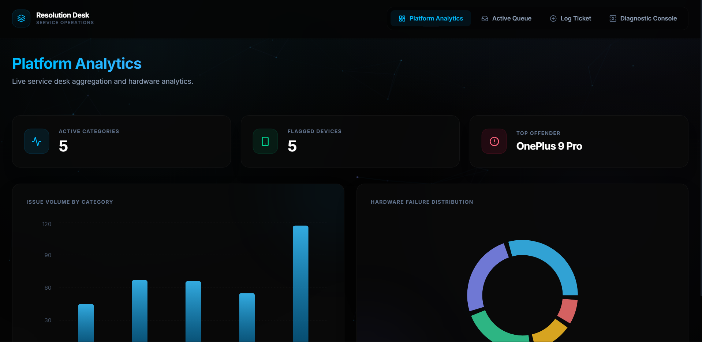
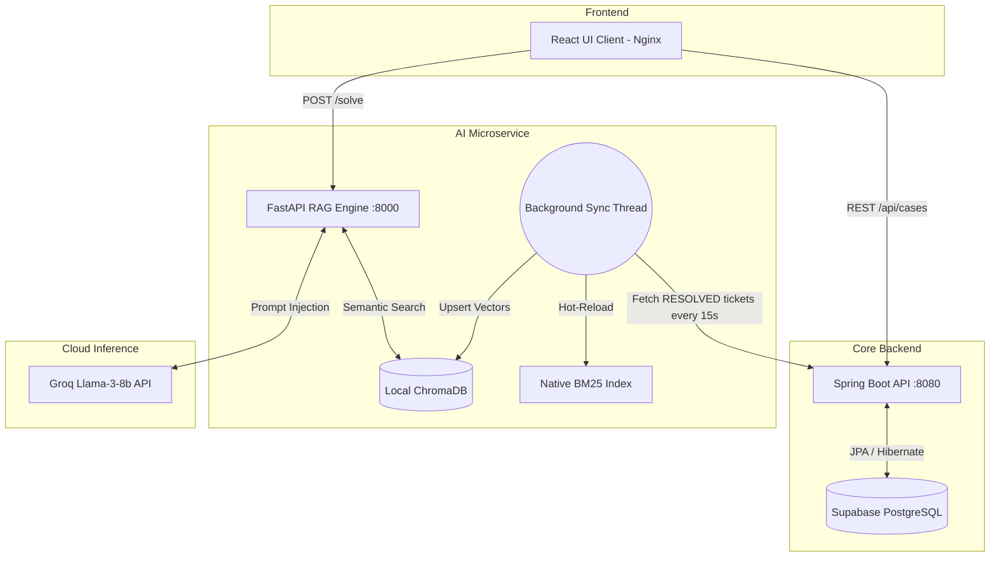

<div align="center">

# Resolution Desk
### Enterprise AI Case Management & Autonomous Triage System

[](https://reactjs.org/)
[](https://spring.io/projects/spring-boot)
[](https://fastapi.tiangolo.com/)
[](https://supabase.com/)
[](https://groq.com/)
[](https://www.docker.com/)

*An autonomous, self-learning IT support platform featuring Hybrid RAG, real-time vector synchronization, and a decoupled microservice architecture.*

**Watch the System Demo:** *(Insert a link to your demo video or GIF here)*

</div>

---

## Table of Contents
- [Core Features](#core-features)
- [System Architecture](#system-architecture)
- [Machine Learning Pipeline](#machine-learning-pipeline)
- [Enterprise Security & Privacy](#enterprise-security--privacy)
- [Project Structure](#project-structure)
- [API Reference](#api-reference)
- [Docker Deployment & Quick Start](#docker-deployment--quick-start)
- [Performance Benchmarks](#performance-benchmarks)
- [Development Roadmap](#development-roadmap)
- [Troubleshooting](#troubleshooting)

---

## Core Features

- **Zero-Hallucination AI Triage:** Automatically solves incoming tickets based exclusively on historically verified company data.
- **Autonomous Database Synchronization:** A background daemon dynamically learns new resolutions logged by human engineers in real-time without requiring server restarts.
- **Enterprise Dashboard:** Real-time analytics tracking system layer outages, hardware faults, and team resolution metrics.
- **Context-Aware Cloud Co-Pilot:** A chat assistant for Level 3 engineers, strictly bound to verified infrastructure runbooks via Reciprocal Rank Fusion (RRF).

---
---

## System Gallery

Here is a look at the Enterprise UI and the AI Co-Pilot in action.

### Main Operations Dashboard
*(React frontend fetching real-time case data from the Spring Boot API)*


### Autonomous AI Triage
*(The Python microservice executing a Hybrid-RAG search and generating a resolution via Groq)*


---

## System Architecture

Resolution Desk operates on a fully decoupled 3-tier microservice architecture.

The most critical component is the **Autonomous Background Worker**. To prevent vector database corruption in distributed environments, the local ChromaDB instance is intentionally excluded from version control. Instead, a lightweight Python daemon wakes up every 15 seconds, queries the Java backend for newly resolved tickets in the Supabase cloud, and dynamically hot-reloads the local neural embeddings.



---

## Machine Learning Pipeline

Standard semantic search (dense retrieval) often fails on highly specific IT infrastructure queries containing exact error codes or hardware serials. To solve this, the `/solve` endpoint runs a custom **Hybrid RRF Pipeline**:

1. **Sparse Retrieval (Native BM25):** A custom-built BM25 engine tokenizes logs and scores exact-keyword matches (TF-IDF).
2. **Dense Retrieval (SentenceTransformers):** `all-MiniLM-L6-v2` maps the structural meaning of the customer's query into high-dimensional vector space via ChromaDB.
3. **Reciprocal Rank Fusion (RRF):** The engine mathematically merges the sparse and dense results to surface candidates that match both exact keywords and overall semantic meaning.
4. **Cross-Encoder Validation:** Finally, a neural reranker (`ms-marco-MiniLM-L-6-v2`) grades the exact contextual relationship between the query and the historical fix.

**Deterministic Fallback Protocol:** If the cross-encoder score falls below `1.0`, the system aborts auto-resolution and raises `FLAG_FOR_REVIEW` to prevent hallucinated fixes on production servers.

---

## Enterprise Security & Privacy

Resolution Desk is engineered with corporate data privacy as a primary directive:
- **Zero-Retention Inference:** The Groq Cloud LLM API is utilized exclusively as a stateless inference engine. No proprietary IT infrastructure data is used to train downstream models.
- **On-Premise Vectorization:** The ChromaDB vector store and sentence-transformer embeddings run 100% locally on the host machine. 
- **Role-Based Access Preparation:** The Supabase PostgreSQL schema is structured to support Row Level Security (RLS) for future multi-tenant deployments.
- **Environment Isolation:** All sensitive credentials are injected dynamically at runtime via Docker, ensuring zero hardcoded secrets.

---

## Project Structure

```text
Resolution-Desk-Enterprise/
├── Frontend & Engine/          
│   ├── frontend/               # React UI (Vite + Nginx, Port 3000)
│   ├── main_api.py             # FastAPI Hybrid RAG Engine and Background Worker (Port 8000)
│   ├── requirements.txt        # Python AI dependencies
│   └── .dockerignore           # Build cache protection
├── java-backend/               
│   └── casemanagement/         # Spring Boot API (Java 17, Port 8080)
├── docker-compose.yml          # Master Container Orchestrator
└── .env                        # Master Environment Secrets (Git-ignored)
```

---

## API Reference

### Core Operations (Spring Boot — Port 8080)
| Endpoint | Method | Description |
| --- | --- | --- |
| `/api/cases` | `GET` | Fetch all cases. Accepts `?status=` and `?category=` filters. |
| `/api/cases` | `POST` | Log a new case. Auto-generates a `CASE-YYYY-XXXXX` ID. |
| `/api/cases/{id}` | `PATCH` | Update ticket status or resolution notes. |

### AI Inference (FastAPI — Port 8000)
| Endpoint | Method | Description |
| --- | --- | --- |
| `/solve` | `POST` | Accepts a ticket description and returns a RAG-verified resolution, or flags it for manual review. |
| `/chat` | `POST` | Interactive co-pilot restricted strictly to verified historical runbook data. |
| `/ping` | `GET` | System health check for the AI microservice. |

---

## Docker Deployment & Quick Start

Resolution Desk is fully containerized. You do not need to install Java, Python, or Node locally to run this application.

### Prerequisites
- Docker Desktop installed and running.

### 1. Clone & Configure Environment
```bash
git clone https://github.com/yourusername/resolution-desk-enterprise.git
cd resolution-desk-enterprise
```

Create a master `.env` file in the root directory:
```env
SPRING_DATASOURCE_URL=jdbc:postgresql://[YOUR_SUPABASE_URL]:5432/postgres
SPRING_DATASOURCE_USERNAME=postgres
SPRING_DATASOURCE_PASSWORD=[YOUR_DB_PASSWORD]
GROQ_API_KEY=[YOUR_GROQ_API_KEY_HERE]
```

### 2. Boot the Entire Stack
Run this single command from the root directory to download dependencies, compile the Java/React code, and boot the private network:

```bash
docker-compose up --build
```

### 3. Access the Services
Once the terminal logs verify the services are running, access them here:
- **Client UI (React/Nginx):** `http://localhost:3000`
- **Core API (Java):** `http://localhost:8080`
- **AI Engine (Python):** `http://localhost:8000`

---

## Performance Benchmarks

*Simulated under standard local development conditions (Apple M-Series / Intel i7):*
- **Vector Retrieval (ChromaDB + BM25):** `< 45ms`
- **Neural Re-ranking (Cross-Encoder):** `< 120ms`
- **LLM Synthesis (Groq Llama-3-8b):** `~ 600ms - 900ms`
- **Total Triage Pipeline Latency:** `~ 1.1 seconds`

---

## Development Roadmap

- **Phase 1 (Completed):** Core Microservices, Hybrid RAG, Autonomous Synchronization.
- **Phase 2 (Completed):** Docker Compose implementation for 1-click containerized deployment.
- **Phase 3 (Upcoming):** Slack/Microsoft Teams webhook integrations for immediate alert triage.
- **Phase 4 (Upcoming):** JWT Authentication and Role-Based Access Control (RBAC) for Level 1 vs Level 3 engineers.

---

## Troubleshooting

- **Vector Database Errors on Boot:** If ChromaDB throws persistent SQLite errors, delete the `vector_store` directory inside `Frontend & Engine`. The autonomous loop will rebuild it from the cloud database automatically on the next boot.
- **Docker API Connection Error:** If Docker throws a `failed to connect to the docker API` error, ensure Docker Desktop is fully open and the engine icon is green before running `docker-compose up`.
- **Port Conflicts:** Ensure ports `8000` (FastAPI), `8080` (Spring Boot), and `3000` (React) are free. Use `kill -9 <PID>` on Unix systems or Task Manager on Windows to terminate stalled processes.

<div align="center">

*Engineered for enterprise IT operations.*

</div>